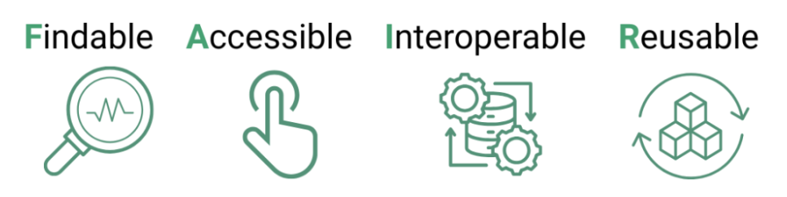

# Curated Collections Omeka Documentation

A help guide to building, describing and publishing research collections with [Omeka-S](https://omeka.org/s/). It is written for users of the ARDC Curated Collections platform, but most of the guidance applies to any Omeka-S installation. Where something is specific to ARDC Curated Collections, the guide says so.

**Live Guide:** https://nikidds29.github.io/curated-collections-omeka-documentation/
> 🚧 **This guide is in development.** An introduction and further sections are coming soon.

## Contents

1. [Introduction](#introduction) *(coming soon)*
2. [Adding content to Omeka-S](#adding-content-to-omeka-s)
   - [CSV Import](docs/csv-import.md)
   - [Adding Media](docs/adding-media.md)
3. [Making your data FAIR](#making-your-data-fair) · [PDF](downloads/ARDC-Omeka-FAIR-Data-Access.pdf)
4. [Pre-publication checklist](#pre-publication-checklist) · [PDF](downloads/ARDC-Omeka-PrePublication-Checklist.pdf)
5. [More guides](#more-guides) *(coming soon)*

## Introduction

*Coming soon.*

## Adding content to Omeka-S

These step-by-step guides use worked examples with screenshots, so each has its own page.

| Guide | What it covers |
|---|---|
| [CSV Import](docs/csv-import.md) | Importing records in bulk with the CSV Import module: single and multiple batches, linking records, media, URIs, multivalue separators, private fields, batch editing and undoing imports |
| [Adding Media](docs/adding-media.md) | Attaching media to items, editing media metadata, File Sideload, batch editing media, primary media and site assets |

## Making your data FAIR

*Future-proof your data!*

> 📄 **[Download as a PDF](downloads/ARDC-Omeka-FAIR-Data-Access.pdf)**

Making your data accessible and usable in the future means making your data FAIR. Adopting the FAIR principles makes it easier for others to find and reuse your data, increasing potential collaboration opportunities and ensuring acknowledgement of your data in other publications.

FAIR is a structured framework to manage the information about your research collection and ensure it is *findable, accessible, interoperable, and reusable* (F.A.I.R) in the long-term.

The FAIR principles are designed to make it easier for humans and machines to locate, access and use your data, while promoting long-term data impact and preservation.

Making your data FAIR does not mean it has to be open, as some data is sensitive or subject to privacy and/or security restrictions. FAIR means that even if restrictions apply to the data, the conditions governing access are clear and transparent.

### The four FAIR principles

Let’s take a closer look at the four pillars of the FAIR principles.



*Figure source: <https://openscience.eu/article/infrastructure/guide-fair-principles>*

#### Findable

This means that the data has enough information (metadata) to be discoverable by humans and machines. This includes:

- Assigning the data a persistent identifier (eg. DOI or URL)

- Ensuring that the information about the data (metadata) is sufficiently descriptive

- Indexing the data in searchable resources

#### Accessible

This means that, once found:

- The data is retrievable using a standard communication protocol (eg. HTTP, HTTPS, FTP)

- There is a well-documented path for people and machines to download the data

- If the data is sensitive, there is a functioning authentication system to control access

- The information describing the data (metadata) is accessible even if the data is not

#### Interoperable

This means that the data can be easily integrated with other data and applications for analysis, storage and processing. This includes:

- Using standard vocabularies or data dictionaries to describe your data

- Referencing and describing relationships to other data

#### Reusable

This means your data contains sufficient information to ensure it can be reused, including:

- Clear licencing and rights statements that are machine readable

- Information about the provenance of the data

- Use discipline-specific metadata schema to ensure it is accessible to other researchers in the domain

### Assess how FAIR your data is

The ARDC provides an online [FAIR data assessment tool](https://ardc.edu.au/resource/fair-data-self-assessment-tool/).

The tool asks these questions to help assess your data against the FAIR principles.

| <span class="smallcaps">Principle</span> | <span class="smallcaps">Question</span>                                                         | <span class="smallcaps">Comments</span>                |
|------------------------------------------|-------------------------------------------------------------------------------------------------|--------------------------------------------------------|
| FINDABLE                                 | Does the dataset have identifiers assigned?                                                     | DOI, PURL, handle, URL                                 |
|                                          | Is the dataset identifier included in all metadata records describing the data?                 | Does the citation of the data include the DOI/URL etc? |
|                                          | How is the data described by the metadata record?                                               | Machine-readable or text-based?                        |
|                                          | What type of searchable repository or registry is the metadata record in?                       | Public? Local?                                         |
| ACCESSIBLE                               | How accessible is the data?                                                                     | Public? Private?                                       |
|                                          | Is there access to the data online? (pending access approval)                                   | Web? Download? No access?                              |
|                                          | Will the metadata record remain accessible even if the data isn’t?                              |                                                        |
| INTEROPERABLE                            | What file format is the data available in?                                                      | Structured? Unstructured? Machine readable?            |
|                                          | What types of vocabularies are used to describe data elements?                                  | Published vocabularies, data dictionaries              |
|                                          | How is the relationship to other data described in the metadata?                                | Resource description framework, URI                    |
| REUSABLE                                 | Are the licencing and usage rights included in the metadata?                                    | Licence URL (eg. Creative commons)                     |
|                                          | Does the information about the data include enough detail about provenance to facilitate reuse? | Standard schema? Machine-readable? Structured?         |

### The policy context: ARDC Curated Collections

Curated Collections is hosted on the Commonwealth National Collaborative Research Infrastructure Strategy (NCRIS) facility managed by the Australian Research Data Commons (ARDC).

NCRIS policy requires that:

> *data generated, created, captured or stored by NCRIS funded projects will be made available to the wider research community based on the F.A.I.R. principles.*

The ARDC also requires the [FAIR principles](https://www.nature.com/articles/sdata201618) to be applied to its own materials and to outputs from co-investment projects.

### References

This module has been developed using the following resources:

Australian Research Data Commons. (2025). FAIR policy: ARDC or ARDC co-invested materials. Zenodo. https://doi.org/10.5281/zenodo.6558998.

Australian Research Data Commons. (2025). FAIR guideline for ARDC co-investment project data outputs (Version 1.6.1). Zenodo. https://doi.org/10.5281/zenodo.17220947

Australian Research Data Commons. (2025). Making Data FAIR. <https://ardc.edu.au/resource-hub/making-data-fair/>.

Australian Research Data Commons. (2024). FAIR Data Training Resources. <https://ardc.edu.au/resource/fair-data-training-resources/>.

Department of Education. *National Collaborative Research Infrastructure Strategy 2023 Guidelines*. 2023. Accessed May 7, 2025. <https://www.education.gov.au/national-research-infrastructure/resources/national-collaborative-research-infrastructure-strategy-2023-guidelines>

GO FAIR. (n.d.). FAIR Principles. <https://www.go-fair.org/fair-principles/>

Open Science EU. (n.d.). A Guide to the FAIR Principles: Best Practices for Data Handling. <https://openscience.eu/article/infrastructure/guide-fair-principles>

Stokes, L., Liffers, M., Burton, N., Martinez, P. A., Simons, N., Russell, K., McCafferty, S., Ferrers, R., McEachern, S., Barlow, M., Brady, C., Brownlee, R., Honeyman, T., & Quiroga, M. del M. (2021, July 13). ARDC FAIR Data 101 self-guided. Zenodo. https://doi.org/10.5281/zenodo.5094034

[↑ Back to contents](#contents)

## Pre-publication checklist

Use this checklist before making your Omeka-S collection public.

> 📄 **[Download as a PDF](downloads/ARDC-Omeka-PrePublication-Checklist.pdf)** (printable version)

### 1. Rights and Permissions

- [ ] I know the copyright status of each item, including for any items with overlapping copyright (eg. Photographs that identify a person)
- [ ] Where copyright status is unknown, I have marked this field as “unknown” and not left it blank
- [ ] I have checked any restrictions on public reuse of items in my collection

| Omeka-S fields (DC) | Omeka-S fields (Schema) | Example             |
|---------------------|-------------------------|---------------------|
| Creator             | Creator                 | S. Mithridites      |
| Rights              | Licence                 | Public Domain       |
| Rights holder       | Copyright holder        | Library of Congress |

### 2. Accessibility

- [ ] Media includes meaningful alt text that describes what a sighted reader would want to know for research purposes
- [ ] Page display choices meet basic legibility standards
- [ ] Embedded multi-media includes transcripts

| Omeka-S attributes |                                                                       | Example                                                                  |
|--------------------|-----------------------------------------------------------------------|--------------------------------------------------------------------------|
| Media → Advanced tab | Alt text                                                              | Portrait photograph of a woman, looking left                             |
| Pages              | Page template/design                                                  | Dark text on a light background, clear headings and a readable font size |
| Media item         | Transcription not built in to Omeka-S, must be in original media item | Oral history MP3 with a PDF transcript attached as a second media file   |

### 3. Identifiers and Linked Data

- [ ] Each item has a stable, unique identifier
- [ ] Each points to an external authority link
- [ ] Controlled identifiers (URIs) are used to identify key fields

| Omeka-S fields (DC) | Omeka-S fields (Schema) | Example                                        |
|---------------------|-------------------------|------------------------------------------------|
| Identifier          | Identifier              | PH-1901-042                                    |
| URI                 | URL                     | https://example.org/s/my-collection/item/42    |
| Relation            | sameAs                  | https://id.loc.gov/authorities/names/n50006412 |

### 4. Metadata Quality

- [ ] All essential fields are complete
- [ ] Dates and names follow a consistent format

| Omeka-S fields (DC)                                                                        | Omeka-S fields (Schema)                                                                      | Example                                                                       |
|--------------------------------------------------------------------------------------------|----------------------------------------------------------------------------------------------|-------------------------------------------------------------------------------|
| Essential fields: title, description, creator, rights, rights holder, identifier, relation | Essential fields: title, description, creator, licence, copyright holder, identifier, sameAs | Dates as YYYY-MM-DD (1847-03-12); names as Surname, Given name (Opie, Amelia) |

### 5. Research collection as dataset

- [ ] I have checked the licences that apply to my own metadata and media objects
- [ ] Citations for the items and collection are correct
- [ ] Each page includes site version or last updated information

[↑ Back to contents](#contents)

## More guides

*Further sections are coming soon.*

## About this repository

```
README.md        The main guide (this page)
docs/            Step-by-step guides with screenshots
docs/images/     Screenshots and figures, one folder per guide
downloads/       PDF versions of the FAIR guide and pre-publication checklist
```

The PDFs are generated from the same source documents as this page. When you update the FAIR section or the checklist here, update the matching PDF too.
