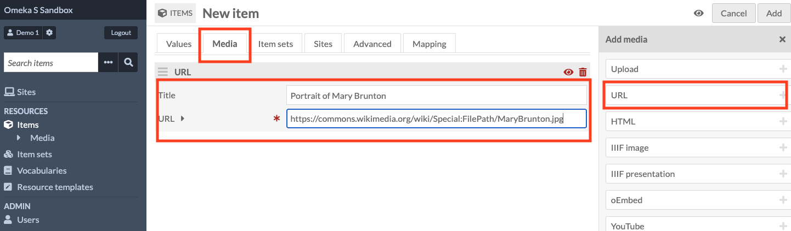
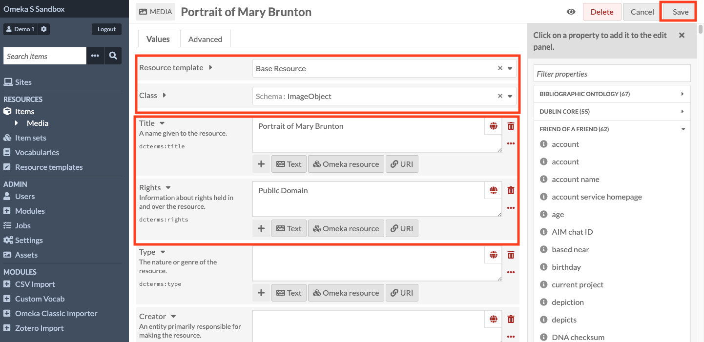
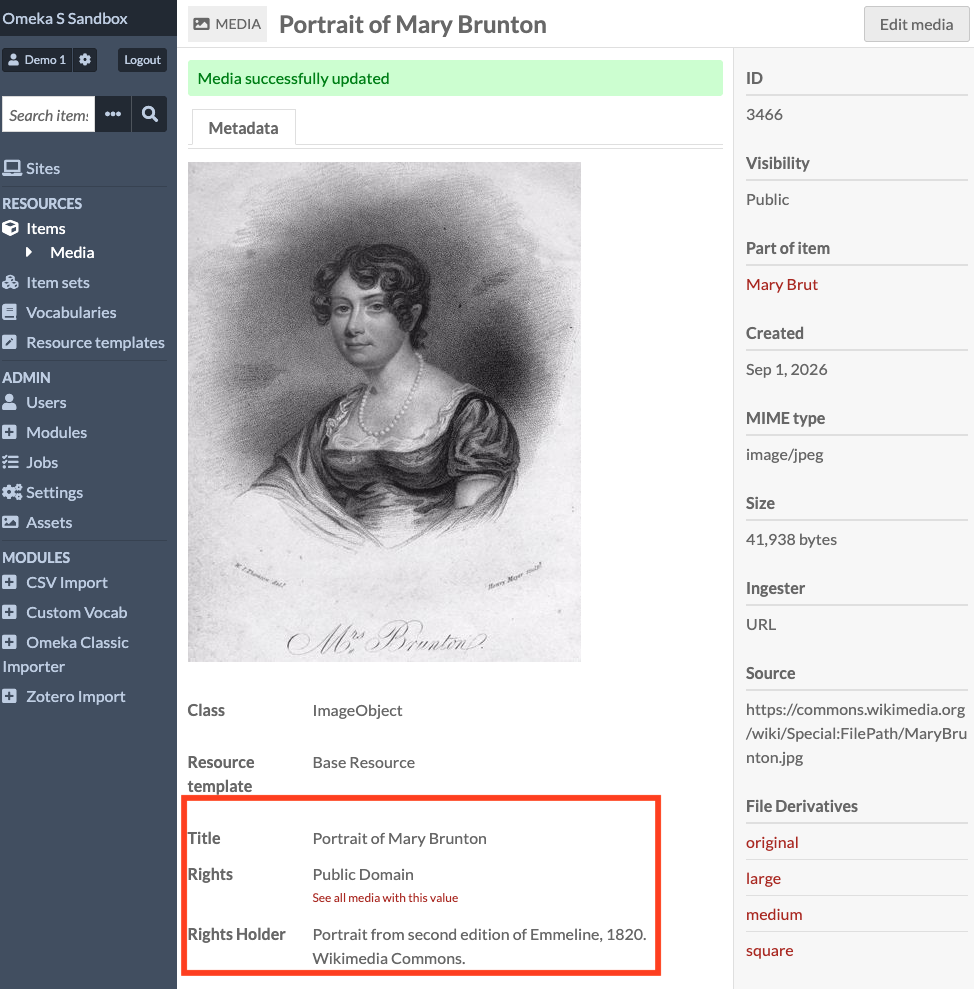
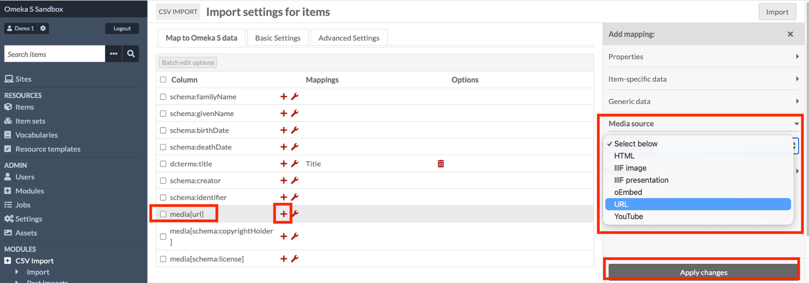
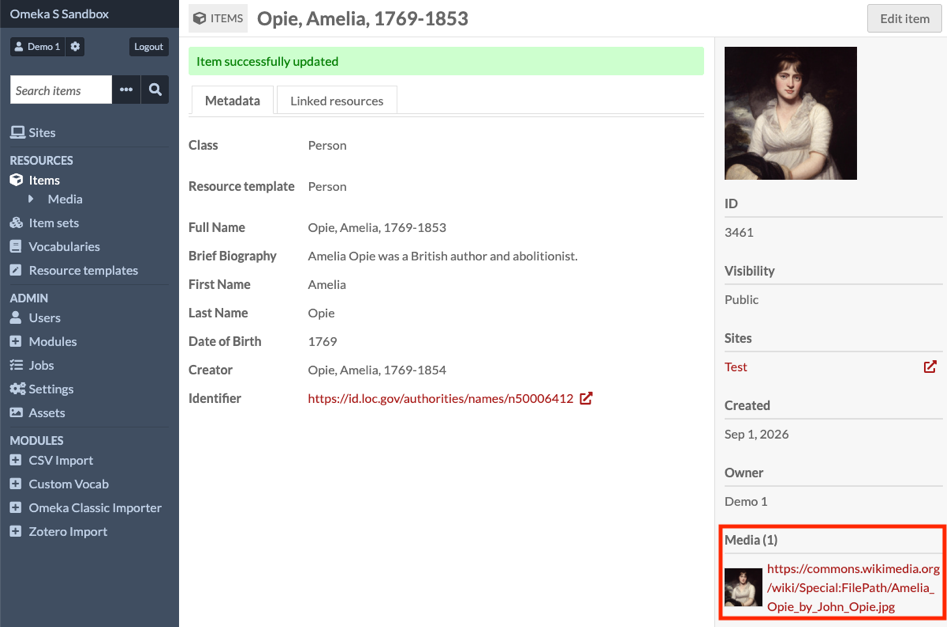
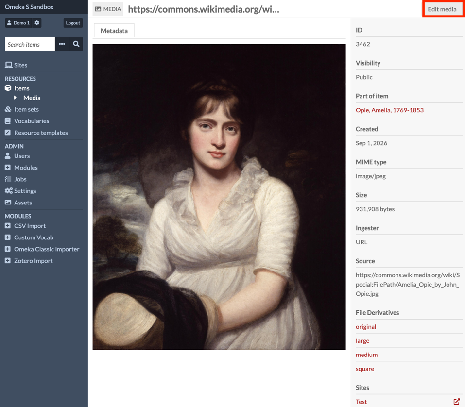
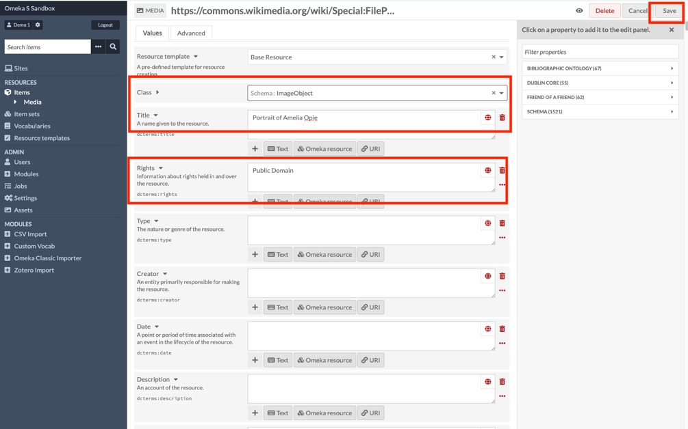
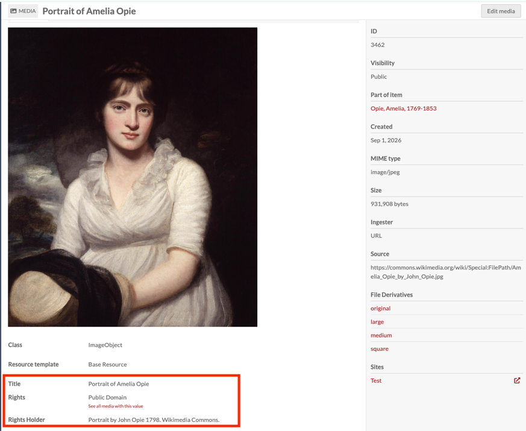

# Adding Media

## Getting Started

Media cannot exist independently of an item on Omeka-S. Media are created by adding them to an item.

When a user attaches media to an item they become the owner of that media.

Logos, banners and custom thumbnails can be added as “assets” (see below). However, assets can’t be resized after upload and should not be used as the core media for an item.

## Adding media with individual records

Media items can be added manually when creating individual records. After creating a new item, select the Media tab. Give your media item a meaningful title and select your input method. I am using URL, but manually adding media also gives you the option to upload media from your local drive.

When the media file has been imported, you can edit the metadata information by clicking on the Edit Media button. Be sure to add licence and rights information.

Once your item has been successfully edited, the media and metadata will display together.

## Adding media on CSV import

For a full walkthrough of importing records, see the [CSV Import](02-csv-import.md) guide.

The CSV Import module can be used to import and attach multiple media files to multiple records using hyperlinks in your spreadsheet. To attach a media file to an item record, your spreadsheet should have a column for the media with a stable URL using the correct file extension for the source media. For example, an image file will have .jpg or .png while an audio file might be .mp3 and a video file .mov. This tells Omeka-S to download the media file and attach it to your record.

For the media to be attached to your item record, it must also be mapped correctly during import. If the media column is mapped as an item property like the other fields, Omeka-S will not display the image, only the link as plain text. To tell Omeka-S to upload the media, don’t choose any property fields for that column. Instead, click on the “+” symbol, and from the Media menu on the right choose “URL”. This tells Omeka-S to get the image from that web address and attach it to the item.

Don’t forget to click “Apply Changes” to save the setting. Once you have added the media as a URL, your “Map to Omeka-S data” Import screen will show this setting in the “Mappings” column.

Omeka-S does not generally permit additional information (metadata) about media items to be added during CSV import. A title is automatically assigned to the media item on import but if the item is added through URL, the title will be the item’s URL. The exception to this is when using File Sideload (see below), where media metadata will remain with items added through File Sideload.

To change the title or add additional metadata information for media items imported through a URL, you will need to edit each item individually after it has been uploaded. See [Adding media with individual records](#adding-media-with-individual-records) above.

Licence and copyright information should be included for all media files whether through using File Sideload or editing media metadata manually after CSV import.

## Editing media metadata

This record for the author Amelia Opie gives the title for the media file as a URL because it was added during CSV Import.

To edit the media metadata, click on the hyperlink, then on Edit Media.

The correct Resource Template and Class should be chosen for the media. Give the media file a descriptive title and add licencing and rights information. Be sure to save before exiting.

The media metadata will now display a title and any other information you added about the image.

## Using file sideload to add media with metadata

Official documentation: [Omeka-S user manual: File Sideload](https://omeka.org/s/docs/user-manual/modules/filesideload/)

The [File Sideload module](https://omeka.org/s/modules/FileSideload) adds the ability to ingest media files that are already stored on the server where your Omeka S installation lives.

File Sideload is compatible with [CSV Import](https://omeka.org/s/docs/user-manual/modules/csvimport/). To use file sideload, you need to create a folder on your server either within the File Sideload module directory or on the same level as the Omeka S installation.

When installed, your CSV Import options will include the ability to add media via filenames in your Sideload directory. Be sure to disable file deletion in the File Sideload module when using it with CSV Import.

## Batch edit media

Batch edit actions include:

- Set visibility to public or private for the entire media.

- Set template from resource template options.

- Set class from installed vocabularies.

- Set owner from users of the site. Ownership determines who can edit and delete media.

- Clear existing language settings.

- Set language using ISO language code.

- Clear property values.

- Set visibility of a specific property or properties to either public or not public.

- Add a property to all media.

- Delete media.

## Multiple media resources per item

If an item has multiple media resources and types attached to it, one file can be chosen as the primary media for the item. This attaches a preview of the media as a thumbnail and displays it as the main media for the item on site pages.

## Adding media “assets” to your Omeka-S site

Assets can be added from the administrator panel. Click the "Add new asset" button in the upper right hand corner of the Assets screen, select the file and click “Upload”. Alt text to support accessibility can also be added during this step.

Assets are maintained at their original size. To have an image display at a different size, you will need to resize it out of Omeka-S.
