[← Back to the main guide](../README.md#adding-content-to-omeka-s)

# CSV Import

Official documentation: [Omeka-S user manual: CSV Import](https://omeka.org/s/docs/user-manual/modules/csvimport/)

Omeka-S offers ways for users to batch import and process their data. However, these methods require some planning and preparation. The most common way to import a large amount of data into Omeka-S is through a module called **CSV Import**. Once installed, it appears under Modules in the left-hand menu of the admin dashboard. On ARDC Curated Collections, CSV Import is pre-installed.

## Getting Started

Before attempting to import your data in Omeka-S, make sure that your data file has been cleaned, standardized and saved as CSV.

- your data must have a header row

- if your columns have more than one value per field, make sure you have used the same separator for all fields

- if you are importing media, make sure your media fields point to a stable URL with the correct extension (for example, .jpg or .png for images or .mp3 for audio or .mp4 for video).

If you need additional guidance on preparing your CSV file see [here](https://omeka.org/s/docs/user-manual/modules/csvimport/#prepare-your-csv-file).

## Importing your data

When you click on CSV Import, an import dialogue box opens for you to upload your CSV file. The default parameters are generally adequate unless you have used a different data delimiter or enclosure. If you have saved your CSV file from Excel, the default delimiter used is the comma.

You should check the “Automap with simple labels” box as this tells Omeka-S to try to match your data to standard fields used after upload. We can change those settings at the next step.

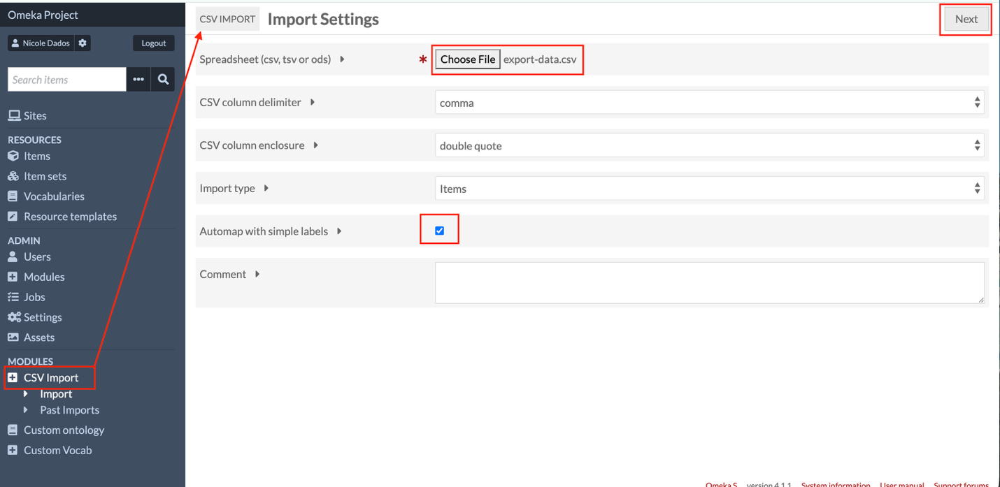

We will look at two use-cases for importing CSV data. Most datasets can be structured in either way. The method you choose to import your data will depend on how you want your users to access the data.

## Import your dataset as a single batch with CSV import

The first case is for importing your dataset as a single batch. Your spreadsheet may or may not have media and external pointing hyperlinks, but the data you intend to import is contained in a single spreadsheet. This process can be used when you don’t intend to create links between entities on Omeka-S.

As you can see from data below, this dataset contains the names of books written by a group of authors, but I don’t intend to organize that data by author, I simply want each book to have a separate record.

In this example, I am treating each book title as my primary resource. To import the data, I need to choose the appropriate Import settings.

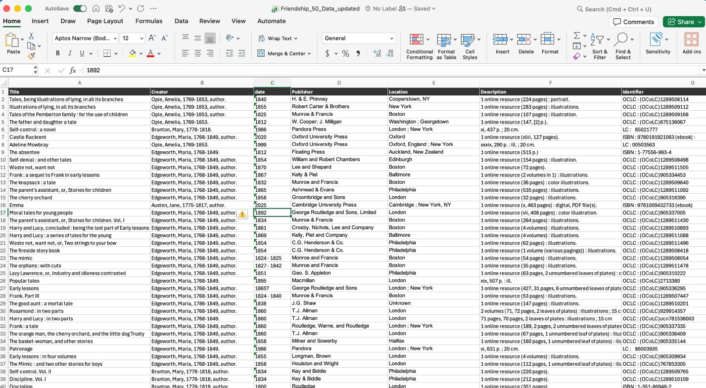

We will start with the “Basic Settings” tab, because if this is not completed correctly, Omeka-S will not import the data. I’ve selected “Artwork” for resource template because it was the most suitable of the available resource templates. We look at how to create custom resource templates elsewhere. I’ve selected “Book” from the Schema vocabulary in the Class menu so Omeka-S knows what kind of resource I am importing. Visibility is set to public and my site is selected because I want to share my data on the web.

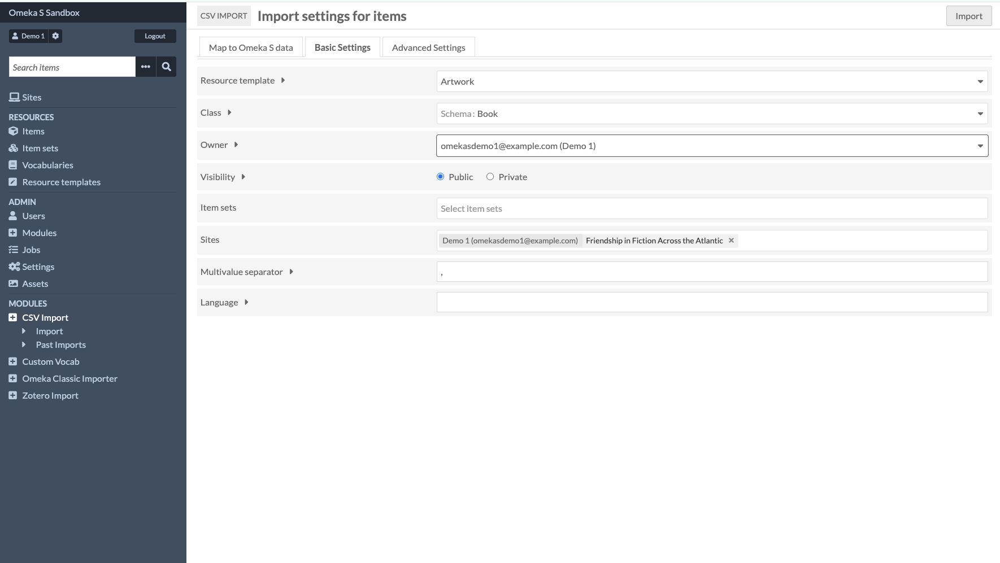

The next tab we need to complete is “Map to Omeka-S data”. This tells Omeka-S how to represent the data we are importing. When I click on this tab, I can see that some of my data has been matched to Omeka-S database fields. If I’m happy with that mapping, I don’t need to change it.

However, if I want Omeka-S to import all my data, I will need to map the fields that were not matched by clicking on the “+” symbol. If any of your data fields don’t have a corresponding Omeka-S field to map to in this screen, that data won’t be imported.

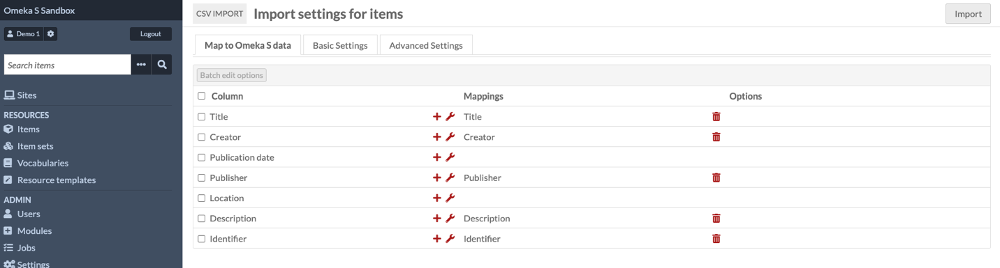

Clicking on the “+” symbol opens the right-hand Mapping menu where I can search for the appropriate field in the “properties” search box.

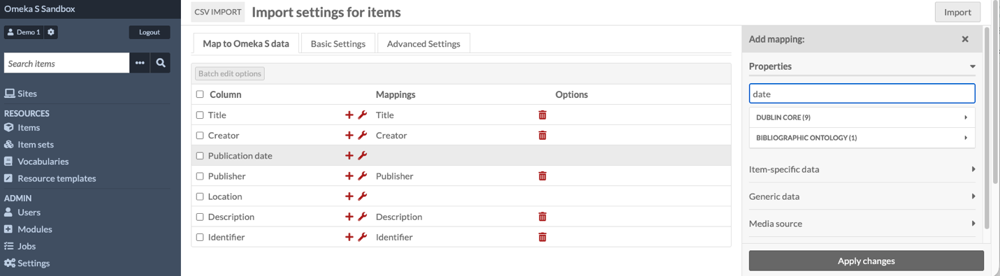

When I find the field I want to use, I select it and click “Apply changes”.

The advanced tab is only used if we want to append or delete existing resources. You can find more information about that [here](https://omeka.org/s/docs/user-manual/modules/csvimport/#advanced-settings-tab).

When I’m happy with how my data will be imported, I click “Import”.

Now under “Items”, I can see all the resources which have been added to my project.

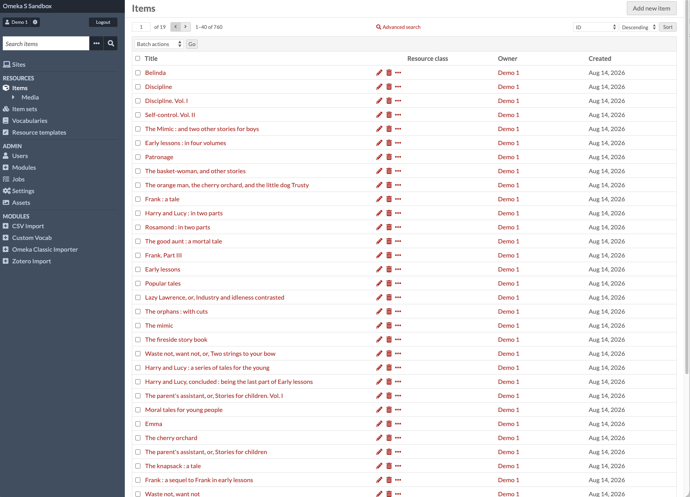

## Import your dataset as multiple batches with CSV import

The second case is for importing your dataset in multiple batches so you can assign internal entities on Omeka-S and create links between them. My sample data set is a list of books published by a group of five authors, with each author having published one or more titles. Instead of having each item appear in an unconnected list, I want to link the books to their authors.

I also want to use my dataset to demonstrate the geographical links between publishing houses by showing which publishing houses were at which location.

From the original data, I’ve created three separate spreadsheets: Creators, Publishers, and Books.

The first thing I’m going to do is upload my Creators information.

I’ve prepared my data as a CSV and chosen Import CSV. In the “Basic Settings” tab, I’ve selected the “Person” resource template and the “Person” class from the Schema vocabulary.

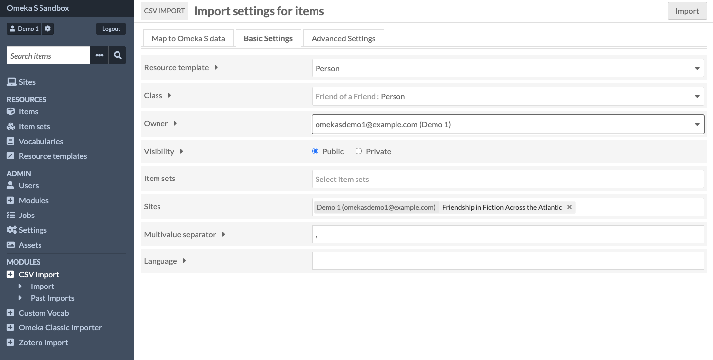

Now I need to map each of my fields so the information displays correctly. Most of my data was mapped automatically, but I want to use the Schema vocabulary so I select the appropriate matching fields.

My author data also uses media and hyperlinks. Mapping these fields correctly is covered in more detail [later in this guide](#importing-images).

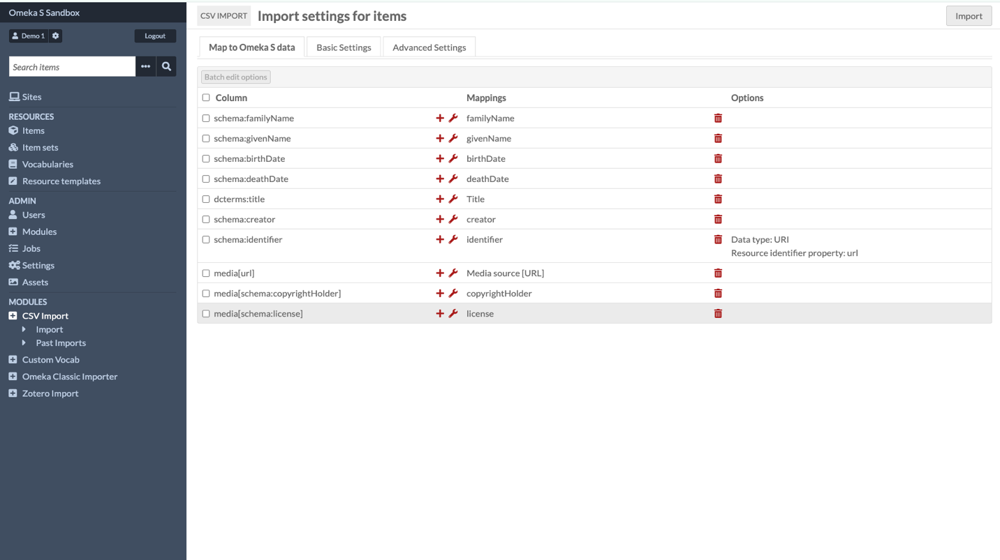

If I map and import my media correctly, Omeka-S adds thumbnails to the records that have attached media. You can see this in my imported Creators list.

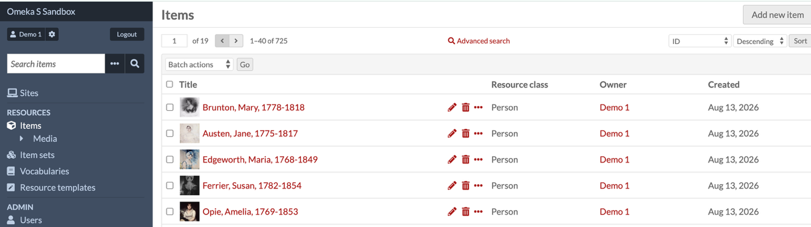

If I click on the item entry for Maria Edgeworth, I can see that my image has been attached and my identifier appears as a hyperlink.

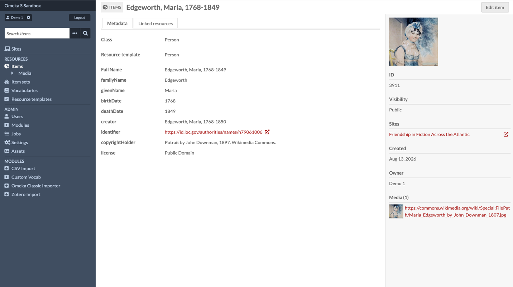

You will have noticed that even though I’ve included copyright information for the image, it’s attached to the author record and not the image itself. My media is identified only by its URL. If I want to change the metadata for my image I have to do it manually after my import. This is one of the limitations of CSV import with Omeka-S.

Next, I’ll import my location data. With this however, I’ll select and match Longitude and Latitude to the corresponding fields in the Mapping tab.

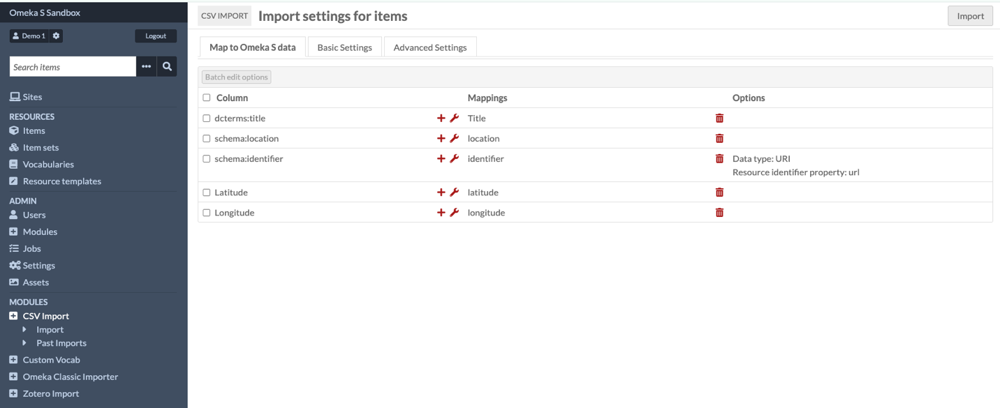

When I import this data, my locations are added as items in my Items list.

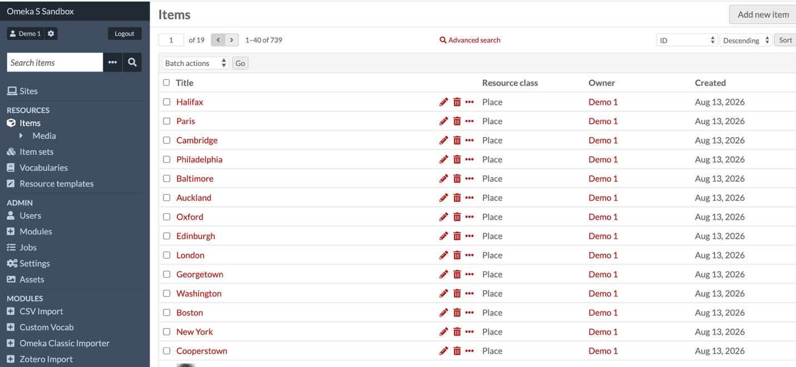

If I click on an entry, I can see that the identifier for my location has been added as a hyperlink.

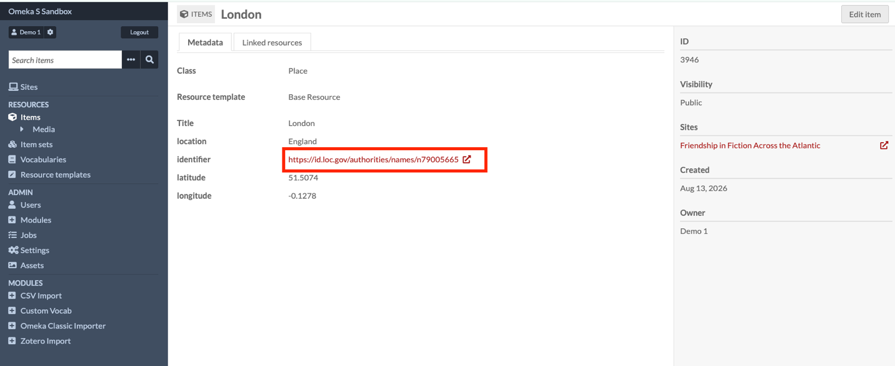

The last part of the process is linking the data I’ve uploaded about my Creators and Locations to my Books data. To do this, I need to change some of the fields in the Books CSV data. I will replace the values in my Creators and Locations columns with the internal IDs that Omeka has created for each of the items I’ve already imported.

To find these internal IDs, click on any item created in Omeka and look for the field “ID”. We can see in the example above that the ID for the location entry “London” is 3946. Similarly, the ID for Jane Austen’s Creator profile below is 3640.

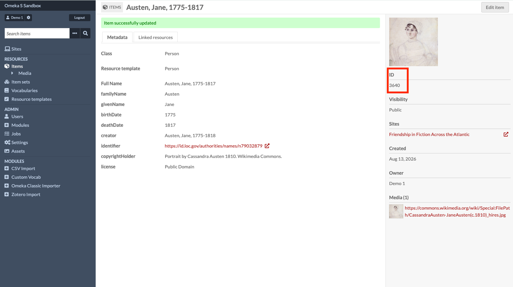

Replacing spreadsheet data with Omeka-S internal IDs can be time consuming with a large dataset. Omeka-S has an export module that allows you to download your data with its internal IDs to speed up the process. Because I have a small dataset, I have done this part manually.

You can see in my spreadsheet, I have replaced the data in the Creator and Location fields with internal Omeka IDs.

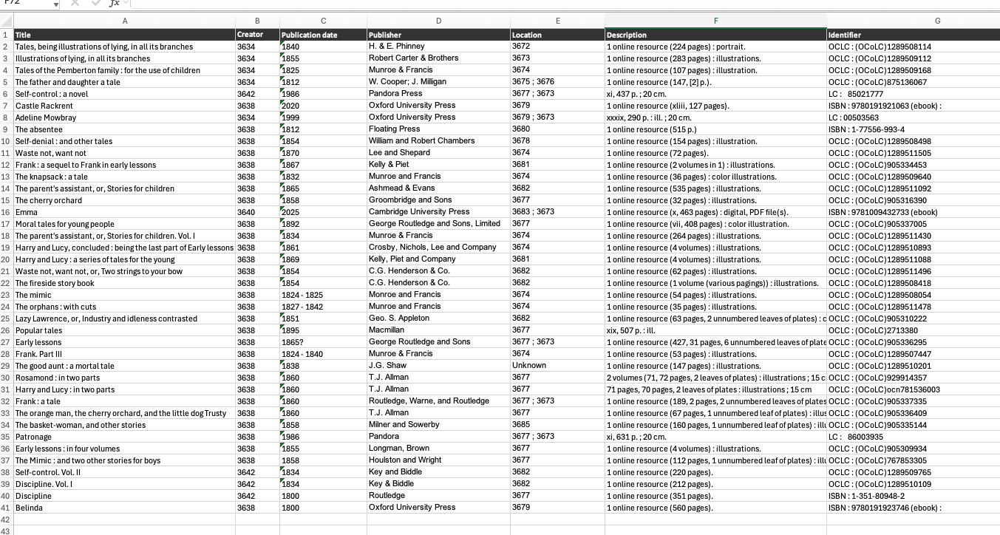

Now I need to map these fields correctly so Omeka links to the Creators and Locations data I’ve already imported. I do this by clicking on the wrench symbol and telling Omeka that this field references an “Omeka resource”, that is, an item that has already been imported. Then I select the appropriate Resource Identifier category for each field so it knows which Omeka Resources to map my data to.

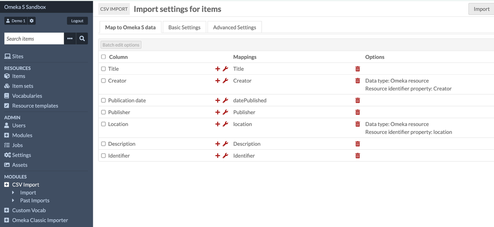

When I link my fields, Omeka adds internal hyperlinks between my Books data and my previously imported Creators and Locations data. If I click on an item record for one of my books for example, I will see that the Creator and Location information has a hyperlink which points to those Omeka records respectively. For example, the entry for the book Discipline has an internal hyperlink to the author Maria Edgeworth and to the location of the publisher in Halifax.

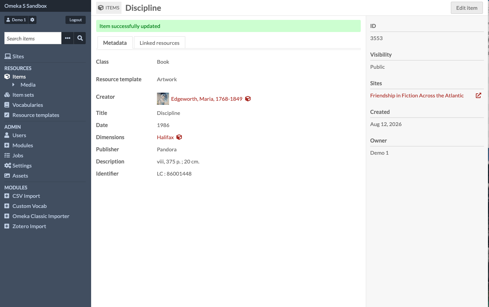

If I click on the link for the Creator Maria Edgeworth, I can view the details of her author entry. Clicking on the tab “Linked Resources” will list all the books assigned to this author on my site.

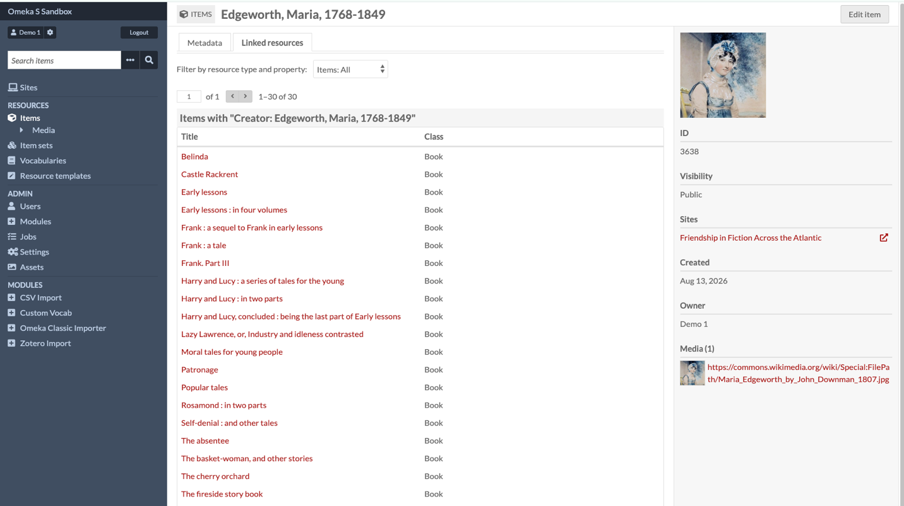

## Importing Images

The CSV Import module allows media files to be imported and attached to items. Generally, media files must be uploaded using a hyperlink that points to the location of the media on a remote server. To attach a copy of the media file to the item record, the media column of the spreadsheet should be formatted as a stable URL and point directly to the media, not a webpage. This means that the URL should have the correct extension for the source media, for example, .jpg for an image or .mov for a video. This tells Omeka-S to download the media file and attach it to your record.

For the media to be attached to your item record, it must also be mapped correctly during import. If the media column is mapped as an item property like the other fields, Omeka-S will not display the image, only the link as plain text. To tell Omeka-S to upload the media, don’t choose any property fields for that column. Instead, click on the “+” symbol, and from the Media menu on the right choose “URL”. This tells Omeka-S to get the image from that web address and attach it to the item.

Don’t forget to click “Apply Changes” to save the setting. Once you have added the media as a URL, your “Map to Omeka-S data” Import screen will show this setting in the “Mappings” column.

Remember to include licence and copyright information for the media with your record. This information remains with the item that displays the image. It can also be added manually to the media after CSV import; see [Editing media metadata](adding-media.md#editing-media-metadata).

![Mappings column showing "Media source [URL]" for the media column](images/csv-import/image20.png)

## Adding URIs and hyperlinks

Omeka-S can also add hyperlinks to records you upload. One useful type of hyperlink added to Omeka-S records is the Unique Resource Identifier, or URIs. These links connect any records we create to other records about the same entity. You will have noticed that all my Creator and Location records had URIs. This allows my users to easily find information about these entities outside of my site. It also improves the searchability of my data by connecting it to other information on the same subject.

I have imported my URIs using the Identifier field, but I want to make sure that when it is imported into Omeka-S it will appear as a hyperlink that my users can click on.

To do this, click on the wrench symbol and select URI from the “Data Type” dropdown menu.

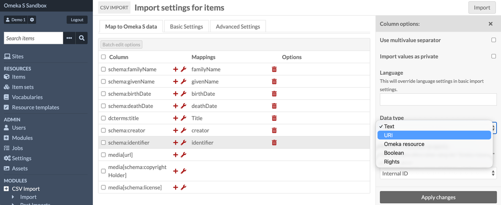

Then, from the “Resource Identifier Property” dropdown menu select URL and click “Apply Changes”.

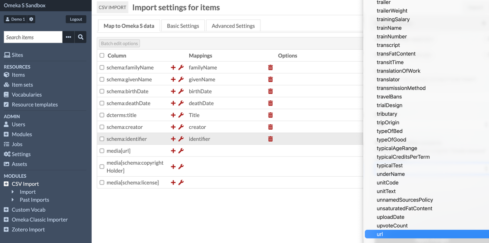

When these settings have been applied, they will appear in the “Options” column.

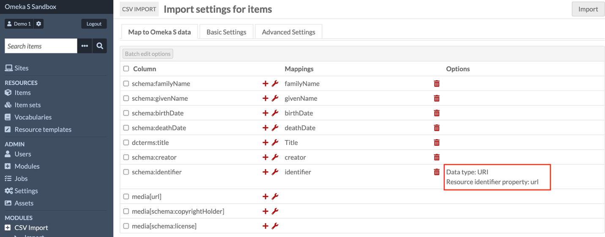

### Multivalue separators

If you have multiple values for a single field, for example, multiple authors for a book, you can separate them with a multivalue separator. You must ensure that this is not the same multivalue separator used to separate your CSV fields. For example, if your CSV sheet uses a comma, you can separate your authors with a semicolon eg. (Austen, Jane; Edgeworth, Maria).

You can designate multivalue separators from the “Map to Omeka-S values” screen when importing your data. Select the field you want to edit, click on the wrench symbol and from Column Options select the checkbox for “Use multivalue separator”.

## Private settings

If you have data fields that you need to import but don’t want to share publicly, you can do this on import. From the “Map to Omeka-S values” in your import screen, select the field you want to keep private, click on the wrench symbol and from Column Options select the checkbox for “Import values as private”.

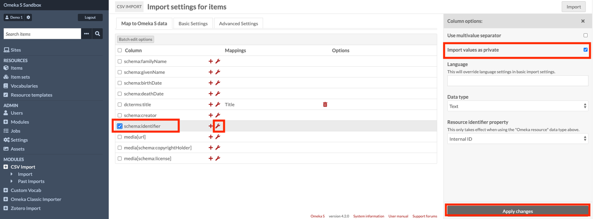

## Batch Edit

Batch actions can be applied to items during CSV Import. Select columns by clicking the checkbox on the lefthand side, select the action to apply, click “Apply Changes”, click “Batch edit options” to apply the change to all items.

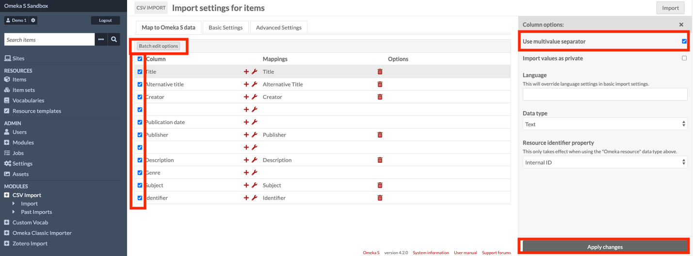

Batch actions can also be applied to items in the Items List after they have been imported. Select the item, choosing the batch action from the dropdown menu, and clicking “Go”.

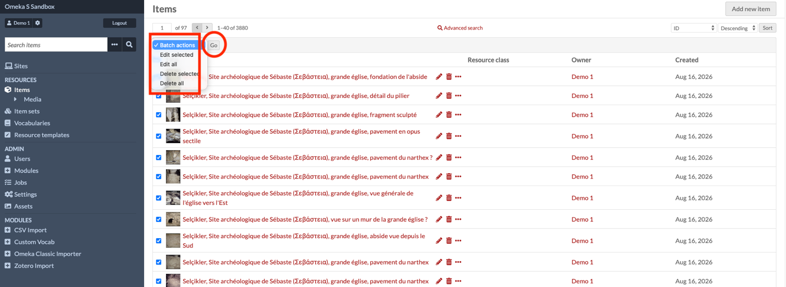

## Undo Past Imports

If you need to delete all the data from one of your imports, Omeka-S provides the option to “undo” past imports. Select the checkbox for the import you want to undo and click “Submit”.

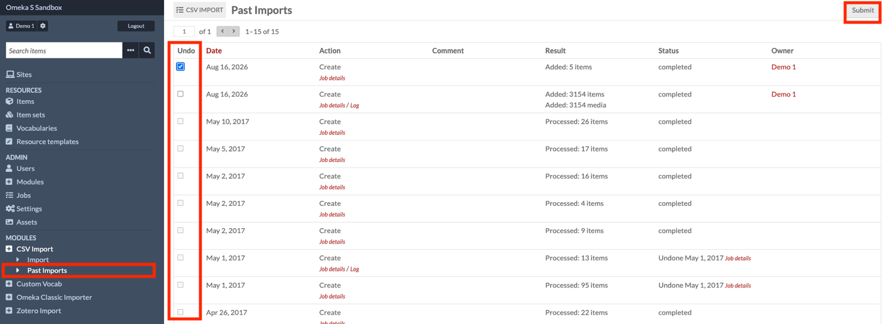

---

[← Back to the main guide](../README.md#adding-content-to-omeka-s)
